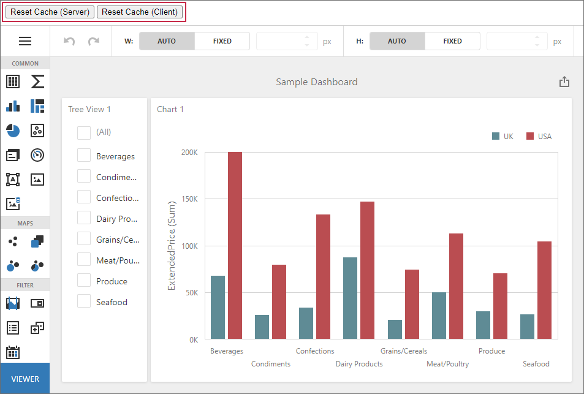

<!-- default badges list -->

<!-- default badges end -->

# Dashboard for ASP.NET Core - How to Reset the Data Source Cache

The following example shows how you can manage the cache in the ASP.NET Core Dashboard control.

To refresh the data source cache **on the server**, pass a unique parameter value to the [DashboardConfigurator.CustomParameters](http://docs.devexpress.com/Dashboard/DevExpress.DashboardWeb.DashboardConfigurator.CustomParameters) event. You can store the unique GUID value within a session as a parameter and update its value in your code when it is necessary to refresh the cache.

To refresh the data source cache **on the client**, you can call the [DashboardControl.reloadData](https://docs.devexpress.com/Dashboard/js-DevExpress.Dashboard.DashboardControl#js_DevExpress_Dashboard_DashboardControl_reloadData) client method.

- Click **Refresh Cache (Server)** to force the cache reset on the server.
- Click **Refresh Cache (Client)** to force the cache reset using the client API.

## Files to Review

- [Index.cshtml](/CS/AspNetCoreDashboardUseDifferentCaches/Views/Home/Index.cshtml)
- [_Layout.cshtml](/CS/AspNetCoreDashboardUseDifferentCaches/Views/Shared/_Layout.cshtml#L19-L31)
- [HomeController.cs](/CS/AspNetCoreDashboardUseDifferentCaches/Controllers/HomeController.cs#L13-L16)
- [Startup.cs](/CS/AspNetCoreDashboardUseDifferentCaches/Startup.cs#L57)
- [CacheManager.cs](/CS/AspNetCoreDashboardUseDifferentCaches/CacheManager.cs)

## Documentation

- [Manage an In-Memory Data Cache](https://docs.devexpress.com/Dashboard/400983/web-dashboard/dashboard-backend/manage-an-in-memory-data-cache)

## More Examples

- [Dashboard for ASP.NET Core - How to Use Parameters to Update a Specific Dashboard Item Without Refreshing the Entire Dashboard](https://github.com/DevExpress-Examples/asp-net-core-dashboard-refresh-item-on-parameter-change)
- [Dashboard for Web Forms - How to Reset the Data Source Cache](https://github.com/DevExpress-Examples/web-forms-dashboard-use-different-caches)
- [Dashboard for MVC - How to Reset the Data Source Cache](https://github.com/DevExpress-Examples/mvc-dashboard-use-different-caches)
